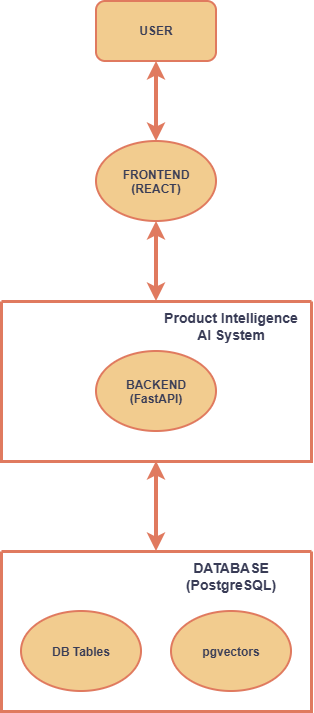
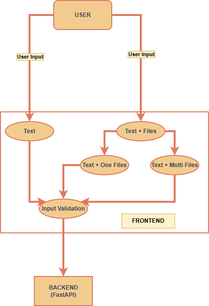
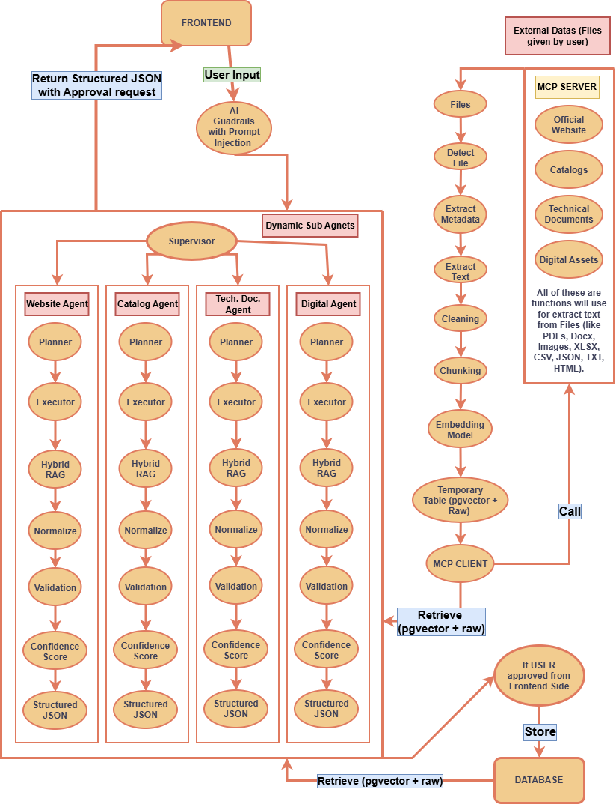
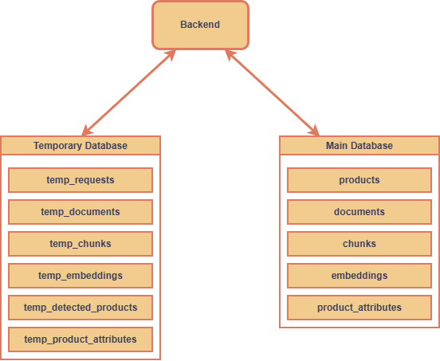

# The Features
**So we know our source datas, Input, and Output. Now I am defining DataFlow of each feature: Creation, Enrichment, and Validation.**

## 1. DFD of User and Product Intelligence AI Interaction

## 2. DFD of User and Frontend Interaction

## 3. DFD of Frontend and Backend Interaction

## 4. DFD of Backend and Database Interaction

## Important Notes
1. **Official Website, Catalogs, Technical Documents, and Digital Assets only usable If needed. This features can be added manually via Frontend Buttons.**
2. **Main Table Always On for retrieval.**
3. **Creation, Enrichment or Validation. All of these must be validate by user.**