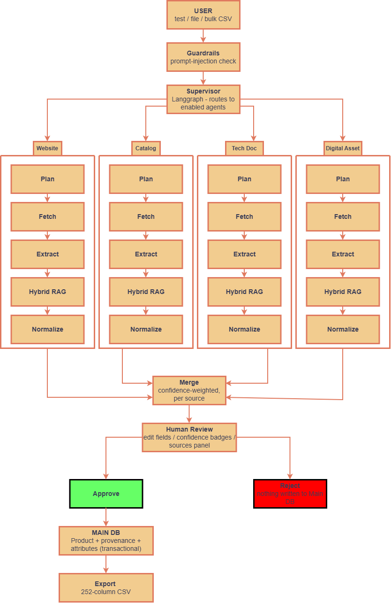
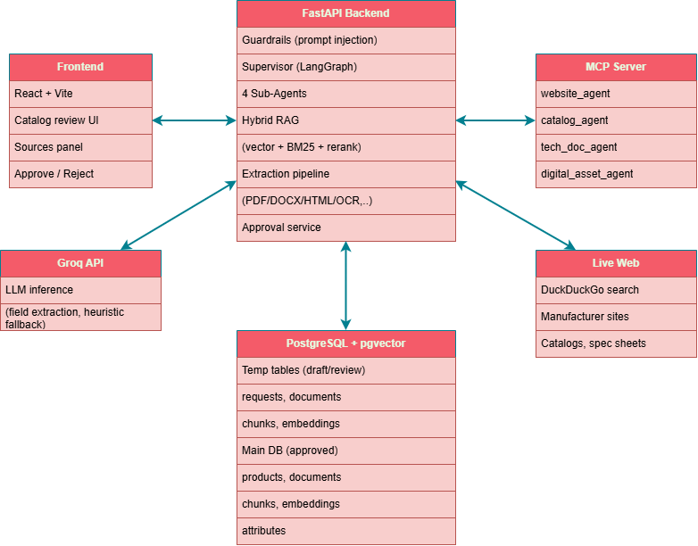
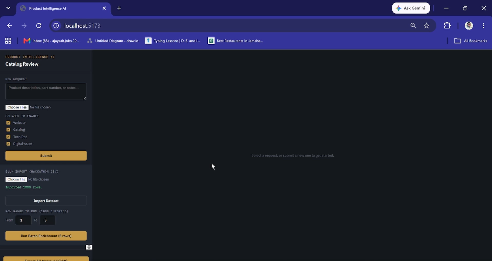
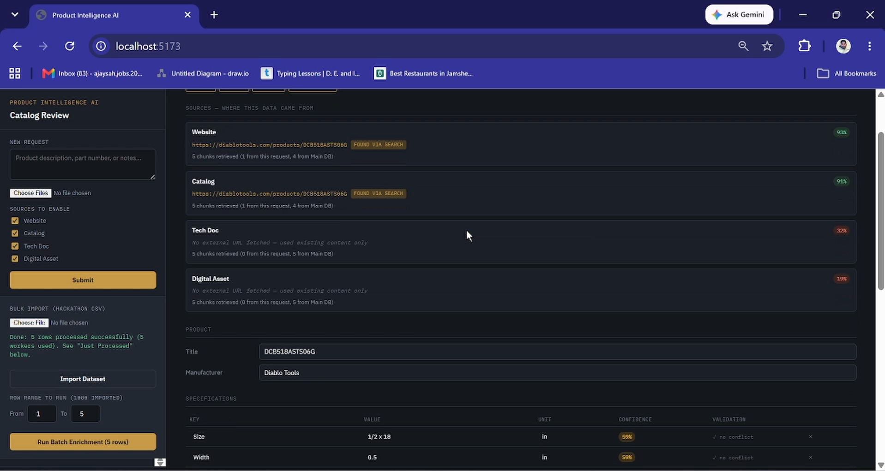
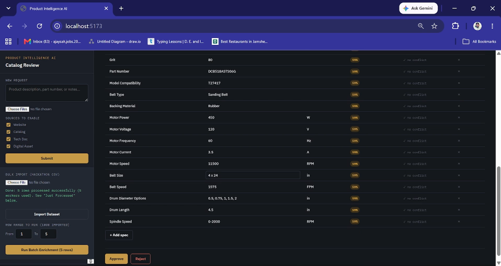
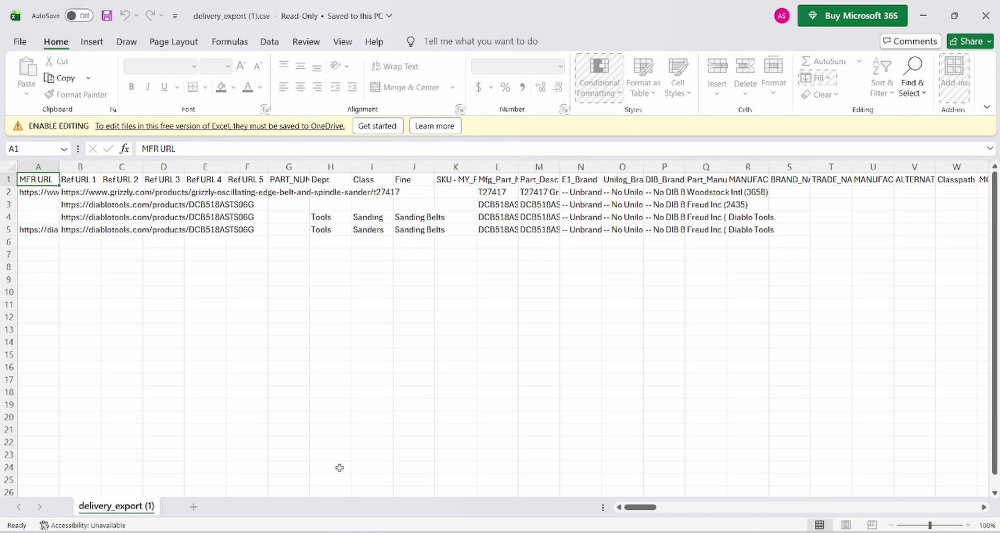

# UniHack Submission -
---

## Team Details
- Team name: **IntelliForge AI**
- Team leader name: **Ajay Sah**

---

## Brief about your solution

Product Intelligence AI is a multi-agent system that turns minimal product data — just a manufacturer part number, a short description, and brand fields — into a fully enriched, 252-column product catalog record matching an enterprise PIM delivery format. A LangGraph-orchestrated Supervisor routes each product to four specialized agents (Website, Catalog, Tech Doc, Digital Asset), each of which independently searches the web, fetches real source documents through a custom MCP (Model Context Protocol) server, extracts and OCRs their content, retrieves the most relevant information via Hybrid RAG, and proposes structured data with a confidence score. Results from all four agents are merged, cross-checked against previously approved products for conflicts, and presented to a human reviewer for editing and approval before anything is written to the permanent catalog. The system is built to process large datasets concurrently, not one row at a time, and exports directly in the exact delivery CSV format required.

---

## How to run

**1. First check that Docker Desktop is installed or not?**

**2. Then Run** 
```docker compose up --build -d```

**3. Services**
*Frontend - http://127.0.0.1:5173*\n
*Backend - http://127.0.0.1:8000*\n
*MCP Server - http://127.0.0.1/8100*\n
*Database - http://127.0.0.1/5432*\n
---

## 1. How does your solution enrich minimal product information?

Given only a part number, brand, and short description, the Supervisor agent activates up to four specialized sub-agents in parallel — Website, Catalog, Tech Doc, and Digital Asset. Each runs its own pipeline: a Planner formulates a source-specific search query, an Executor performs a live web search (when no URL is already known) and fetches the resulting page or document through dedicated MCP tools, and an extraction layer converts PDFs, Word documents, HTML pages, spreadsheets, and images (via OCR) into clean text. That text is then retrieved through a Hybrid RAG step — combining vector similarity search, BM25 keyword search, Reciprocal Rank Fusion, and a cross-encoder reranker — before an LLM-based Normalize step extracts structured fields: title, manufacturer, technical specifications, features, dimensions, identifiers (UPC/EAN/GTIN), warranty, price, and category. The four agents' outputs are merged using confidence-weighted selection, turning a six-field input row into a fully populated 252-column output record.

## 2. How does your solution ensure accuracy and trust in the generated product data?

- **Confidence scoring**: every field carries a confidence score derived from retrieval quality (the cross-encoder reranker's relevance score), visible per-field in the review UI.
- **Multi-source verification**: up to four independent agents research the same product from different angles (official site, catalog listings, technical documentation, product imagery); agreement across sources strengthens confidence, disagreement is surfaced explicitly.
- **Validation / conflict detection**: newly retrieved data is automatically checked against previously approved data for the same or related products; contradictions (e.g. a new source claiming a different wattage than what's already on record) are flagged as explicit conflicts, not silently overwritten.
- **Human-in-the-loop approval**: no data reaches the permanent catalog without explicit human review and approval; every field is editable before approval, and a full "Sources" panel shows exactly which URL each agent used and whether it was found automatically or provided — full provenance, not a black box.
- **AI guardrails**: an input-validation layer screens for prompt-injection attempts before any agent runs, protecting the pipeline from adversarial input.

## 3. What makes your solution scalable for enterprise product catalogs?

- **Concurrent batch processing**: products are processed in parallel across a worker pool (sized to leave headroom for the OS, not saturate all CPU cores), rather than one row at a time — built specifically to handle datasets with thousands of rows.
- **New manufacturers**: the pipeline makes no manufacturer-specific assumptions — it discovers manufacturer identity and sourcing dynamically per product via live web search, so it requires no pre-configuration to support a new brand.
- **Different document formats**: the extraction layer already handles PDF, DOCX, TXT, HTML, CSV, XLSX, and image formats (with OCR for scanned pages and embedded diagrams/photos), and the MCP-tool architecture makes adding new source types straightforward.
- **Continuous updates**: approved products remain in the database as a permanent, growing knowledge base — every new enrichment run cross-references and validates against everything approved before it, so data quality compounds over time rather than resetting per run.
- **Infrastructure**: a relational + vector database (PostgreSQL with pgvector) scales both structured queries and semantic search; the whole system is containerized for straightforward deployment.

---

## Opportunities

**a. How different is it from other existing ideas?**
Most product-enrichment tools are a single LLM call against a static prompt. This solution is a genuine multi-agent system — four independently-reasoning agents, each with its own retrieval pipeline, real web search, real document fetching (not just LLM recall), and real OCR — coordinated by an explicit Supervisor graph, with results merged and cross-validated rather than trusted blindly.

**b. How will it solve the problem statement?**
It directly automates the three required pillars — Creation (net-new products), Enrichment (filling gaps in partially-known products), and Validation (catching disagreements between sources and existing records) — using the same unified pipeline, driven purely by whether a Main DB match already exists for a given product.

**c. USP of the proposed solution**
Full source transparency: for every generated field, the system shows exactly which URL it came from and how it was found. Combined with per-field confidence scoring and explicit conflict flagging, this makes the output auditable rather than a black box — critical for enterprise trust in AI-generated catalog data.

---

## List of features offered by the solution

- Three input modes: free-text description, file upload (PDF/DOCX/images/etc.), and bulk CSV import
- Four specialized, independently-toggleable retrieval agents: Website, Catalog, Tech Doc, Digital Asset
- Real web search + real document fetching via a custom MCP server (not simulated)
- Full extraction pipeline: PDF, DOCX, TXT, HTML, CSV, XLSX, and OCR for images (including embedded images and scanned pages)
- Hybrid RAG retrieval: vector search + BM25 + Reciprocal Rank Fusion + cross-encoder reranking
- LLM-based structured field extraction with an automatic fallback mode when no LLM key is configured
- Per-field confidence scoring
- Automated conflict/validation detection against previously approved catalog data
- Full source-provenance panel: shows exact URL, discovery method, and retrieval stats per agent
- Editable human review interface before approval
- Transactional approval flow: nothing reaches the permanent catalog without explicit sign-off, and nothing is left half-written if something fails
- Concurrent batch processing sized to available CPU cores (and GPU, when available)
- CSV export matching the exact 252-column delivery format, both per-product and as a full bulk export
- Fully containerized (Docker Compose) deployment: database, backend, MCP server, and frontend

---

## Process flow diagram


## Architecture diagram


## Technologies used in the solution

**Backend**: Python, FastAPI, SQLAlchemy, PostgreSQL + pgvector
**AI/ML orchestration**: LangGraph (multi-agent Supervisor), LangChain-Groq (LLM inference)
**Retrieval**: sentence-transformers (embeddings + cross-encoder reranker), BM25 (rank_bm25), Reciprocal Rank Fusion, custom MCP server/client for tool-based retrieval
**Document processing**: PyMuPDF (PDF), python-docx (Word), BeautifulSoup (HTML), openpyxl (Excel), EasyOCR (image/scanned-page text extraction)
**Frontend**: React, Vite
**Infrastructure**: Docker, Docker Compose
**Concurrency**: Python ThreadPoolExecutor-based batch processing, GPU-aware model loading with automatic CPU fallback

---

## Estimated implementation cost (optional)

Built entirely on open-source components except LLM inference, which runs on Groq's API (has a free tier; low per-token cost at scale). No proprietary licensing costs. Primary ongoing cost at production scale would be LLM API usage and hosting/compute for the database and backend services.

---

## Snapshots of the MVP

**Imported Bulk CSV File**


**4 Sub-agents**


**Spec features & Approve/Reject**


**Exported CSV File with 252-columns**


---

## Additional Details / Future Development

- In-place enrichment: currently, re-enriching a known product creates a new record rather than updating the existing one in place — planned improvement.
- Background job queue with progress polling for very large batch runs (currently synchronous batch calls, which is fine for tens of rows but not thousands in one request).
- Richer automatic category (Department/Class/Fine) classification.
- Title-cleaning pass to avoid raw scraped breadcrumb/HTML-title artifacts.

---

## Links

- GitHub Public Repository: **[[YOU FILL IN — push your code to a public repo]](https://github.com/ajaysah-ai/Product-Intelligence-AI)**
- Demo Video Link (3 minutes): **https://drive.google.com/file/d/1JeqX0mjZsFU4vs23cLST9tqE55yFBgzx/view?usp=drivesdk**

---
